```{r setup, include=FALSE}
knitr::opts_chunk$set(echo = FALSE, warning = FALSE, message = FALSE,
                      fig.align = "center", out.width = "100%")
```

```{r fig-counter, include=FALSE}
# Simple figure counter by section
fig_n <- new.env(parent = emptyenv())
fig_n$s1 <- 0
fig_n$s2 <- 0
fig_label <- function(section) {
  fig_n[[section]] <- fig_n[[section]] + 1
  paste0("Figure ", section, ".", fig_n[[section]], ":")
}
```

## TL;DR

This document describes the development and validation of a multi-method spatial correction framework for field-based trial data in R. Spatial variation across field plots or glasshouse benches caused by irrigation gradients, soil heterogeneity, edge drying, and microclimate effects, potentially may bias phenotypic measurements and therefore impact genotype rankings. Correcting for this variation is essential before downstream analyses such as GWAS.

The report is structured in two parts:

**Part 1** compares three packages; SpATS, mgcv and sommer on replicated real data. The gam fitted using mgcv using derfault settings substantially under-corrects relative to SpATS and sommer. The performance gap is due to a single missing model component: row and column random effects. Adding these closes the gap entirely (r = 0.9996 with SpATS).

**Part 2** addresses the primary use case to correct phenotypes where genotypes are unreplicated within each field/plot/bench (herefter referred to as bench) but replicated across spatial units. Per-bench models (including SpATS) can only produce BLUPs (shrunken estimates), compressing genotype differences and are not particularly suitable for downstream GWAS. Joint multi-bench models recover proper BLUEs by pooling information across benches, reducing RMSE by approximately 3× relative to averaged per-bench BLUPs (~2.1 vs ~6.2).


## Part 1: Per-bench unit correction with replicated Data

### The problem

Field/glasshouse trials assign genotypes to plots/pots arranged in a row-by-column grid. The observed phenotype for plot $(r, c)$ assigned to genotype $i$ can be written:

$$y_{irc} = g_i + \xi(r, c) + \varepsilon_{irc}$$

| Term | Meaning |
|------|---------|
| $y_{irc}$ | Observed phenotype at row $r$, column $c$ |
| $g_i$ | True genotype effect — the quantity we want to estimate |
| $\xi(r, c)$ | Spatially structured environmental effect (soil gradients, irrigation patterns, edge effects) |
| $\varepsilon_{irc}$ | Plot-level random noise, $\varepsilon \sim N(0, \sigma^2_e)$ |

If $\xi(r,c)$ is not modelled, genotype estimates may be confounded with the spatial pattern. Spatial correction aims to estimate and remove $\xi(r,c)$, recovering unbiased genotype effects $\hat{g}_i$.

In a **replicated** design (multiple observations per genotype), genotype effects can be estimated as fixed effects producing BLUEs (Best Linear Unbiased Estimates). BLUEs are unshrunken estimates on the true phenotypic scale, the preferred input for GWAS.

### Model specifications

Three packages are implemented, two which have been developed specifically for this problem (SpATS and sommer) and one more general modelling package (mgcv). All share the same conceptual structure — estimate a 2D spatial surface and extract genotype effects — but differ in how the surface is modelled and estimated.

#### SpATS

SpATS (Spatial Analysis of field Trials with Splines) uses a PSANOVA decomposition of the 2D spatial surface:

$$y_{irc} = \mu + g_i + f_{\text{SAP}}(r, c) + \rho_r + \kappa_c + \varepsilon_{irc}$$

| Term | Type | Description |
|------|------|-------------|
| $\mu$ | Fixed intercept | Grand mean |
| $g_i$ | Fixed (BLUEs) or Random (BLUPs) | Genotype effect |
| $f_{\text{SAP}}(r, c)$ | Penalised fixed smooth | 2D P-spline spatial surface via SAP decomposition. Smoothness controlled by B-spline segments (`nseg`) and an estimated penalty parameter. Adaptive `nseg = min(max(5, floor(n/2)), 20)` per direction. |
| $\rho_r$ | Random: $\rho_r \sim N(0, \sigma^2_\rho)$ | Row random intercept — captures systematic row-level effects not absorbed by the 2D smooth |
| $\kappa_c$ | Random: $\kappa_c \sim N(0, \sigma^2_\kappa)$ | Column random intercept — captures systematic column-level effects |
| $\varepsilon_{irc}$ | $N(0, \sigma^2_e)$ | Plot-level residual |

SpATS includes row and column random effects by default.

**Note on spatial surface scaling:** SpATS's PSANOVA decomposition constrains each component of $f_\text{SAP}$ (row, column, interaction) independently, but the combined surface is not constrained to be zero-mean over the observed data. As a result, `predict(model, which = genotype)` returns BLUEs that are $\approx \bar{\xi}$ below the phenotype scale, where $\bar{\xi}$ is the mean of the fitted spatial surface. For `wheatdata`, $\bar{\xi} \approx 64$ units. The framework corrects for this by centring the spatial surface ($\xi \leftarrow \xi - \bar{\xi}$) and adding $\bar{\xi}$ back to all BLUEs/BLUPs, so SpATS estimates are on the same absolute scale as mgcv and sommer.

#### mgcv with default arguments

mgcv fits a generalised additive model with a tensor-product smooth for the spatial surface:

$$y_{irc} = g_i + \text{te}(r, c) + \varepsilon_{irc}$$

| Term | Type | Description |
|------|------|-------------|
| $g_i$ | Fixed (`0 + Genotype`) | Genotype effect — each coefficient is directly a BLUE |
| $\text{te}(r, c)$ | Penalised tensor-product smooth | Anisotropic 2D spatial surface with smoothness estimated automatically by REML. No manual `nseg` required. |
| $\varepsilon_{irc}$ | $N(0, \sigma^2_e)$ | Plot-level residual |

The default mgcv model does not include row/column random effects.

#### sommer

sommer models the spatial surface as a random effect rather than a fixed smooth:

$$y_{irc} = \mu + g_i + u_{rc} + \rho_r + \kappa_c + \varepsilon_{irc}$$

| Term | Type | Description |
|------|------|-------------|
| $\mu$ | Fixed intercept | Grand mean |
| $g_i$ | Fixed (BLUEs) or Random (BLUPs) | Genotype effect |
| $u_{rc}$ | Random: $\mathbf{u} \sim N(\mathbf{0}, \sigma^2_s \mathbf{K})$ | 2D P-spline spatial surface via `spl2Dc()`, where $\mathbf{K}$ is a Kronecker product of B-spline bases with second-difference penalty. Treated as a random effect — shrunk toward zero. |
| $\rho_r$ | Random: $\rho_r \sim N(0, \sigma^2_\rho)$ | Row random intercept |
| $\kappa_c$ | Random: $\kappa_c \sim N(0, \sigma^2_\kappa)$ | Column random intercept |
| $\varepsilon_{irc}$ | $N(0, \sigma^2_e)$ | Plot-level residual |

sommer includes row/column random effects by default. The spatial surface is random (mean zero), whereas in SpATS and mgcv it is a fixed smooth.

**note:** `spl2Dc()` requires `sommer::mmes()`, not `mmer()`. BLUEs use treatment contrasts and must be recovered via `model.matrix(~ Genotype) %*% m$b`.

### Comparing methods for single bench replicated data

The framework was validated on the `wheatdata` dataset: **330 plots, 107 genotypes, 3 replicates, 22 rows × 15 columns**. All three methods were run with `output_type = "BLUEs"`.

#### Baseline SpATS diagnostic output

```{r s1-spats-diag, fig.cap="**Figure 1.1:** SpATS diagnostics on wheatdata. The spatial trend (top right) captures a strong gradient from high values in the top-left to low values in the bottom-right — consistent with an edge/irrigation effect. The residual variogram (bottom right) is substantially flatter than the observed variogram (bottom centre), indicating successful removal of spatial autocorrelation."}
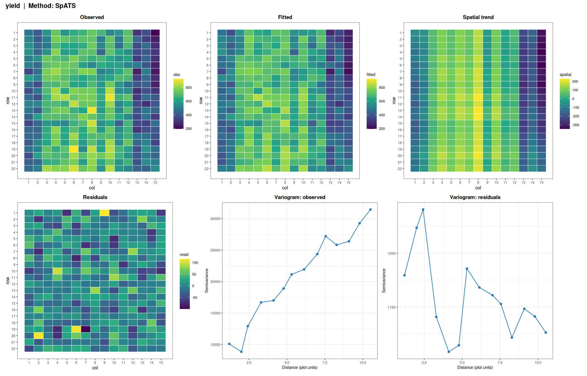
```

#### Three-method comparison

```{r s1-method-comparison, fig.cap="**Figure 1.2:** Method comparison on wheatdata. Top row: estimated spatial trend heatmaps for SpATS, mgcv (default), and sommer. SpATS and sommer capture similar patterns with comparable magnitude. Default mgcv captures a substantially weaker pattern. Bottom row: pairwise BLUE correlations. After centring the SpATS spatial surface (see spatial surface scaling note above), all three methods produce BLUEs on the same absolute phenotype scale. SpATS and sommer are near-identical (r = 0.992) and sit on the 1:1 line. Default mgcv diverges from both (r = 0.871) due to under-correction, not a scale shift."}
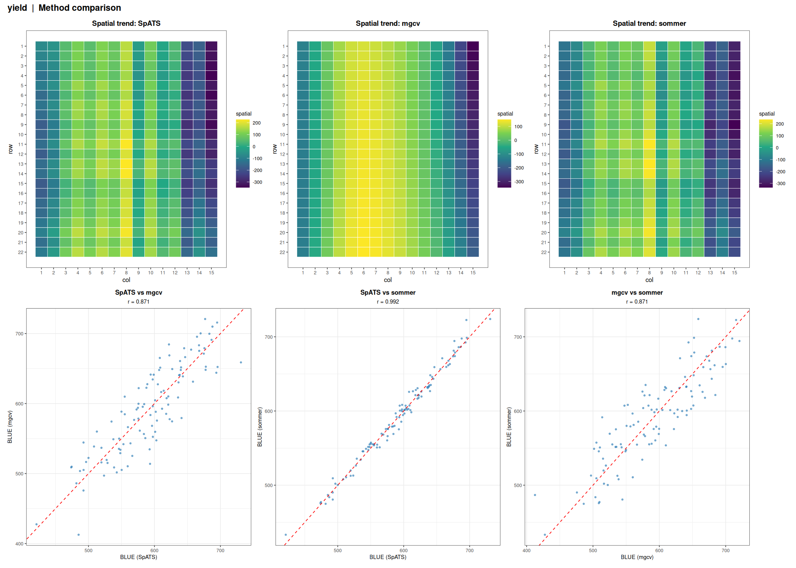
```

#### Summary metrics

| Metric | SpATS | mgcv (default) | sommer |
|--------|-------|----------------|--------|
| Residual SD | 34.05 | 63.01 | 33.18 |
| BLUE correlation with SpATS | --- | 0.871 | 0.992 |

The default mgcv model leaves residual SD nearly twice that of SpATS and sommer. This motivated the investigation below.

### Closing the mgcv performance gap

#### Rationale

The under-correction by default mgcv could stem from two differences relative to SpATS and sommer:

1. **Spline basis type** — mgcv uses cubic regression (cr) by default; SpATS and sommer use P-splines
2. **Row/column random effects** — SpATS includes `random = ~ row + col`; sommer includes row + col in its random formula; mgcv includes neither

Five mgcv variants were tested to isolate the cause:

| Variant | Spline basis | k (complexity) | Row/col RE |
|---------|-------------|----------------|------------|
| `mgcv` (default) | Cubic regression | Default | No |
| `mgcv_ps` | P-spline | Adaptive | No |
| `mgcv_ps_re` | P-spline | Adaptive | Yes |
| `mgcv_highk` | Cubic regression | Adaptive (high) | No |
| `mgcv_ad` | t2 (alternative tensor) | Adaptive | No |

The `mgcv_ps_re` variant adds `s(row_f, bs="re") + s(col_f, bs="re")` to the P-spline tensor product, matching the row/column random effects present in SpATS and sommer.

#### Results

```{r s1-variants-table}
variants_df <- read.csv("../output/section1/mgcv_variants_summary.csv")
knitr::kable(variants_df, digits = c(0, 2, 4),
             col.names = c("Method", "Residual SD", "r with SpATS BLUEs"),
             caption = "**Table 1.1:** Comparison of all seven methods on wheatdata (330 plots, 107 genotypes, 3 replicates). Residual SD measures unexplained variation after spatial correction (lower is better). Correlation with SpATS BLUEs measures agreement in genotype rankings.")
```

#### mgcv_ps_re diagnostic output

```{r s1-psre-diag, fig.cap="**Figure 1.3:** mgcv_ps_re diagnostics on wheatdata. The spatial trend, residual heatmap, and variograms are virtually identical to those from SpATS (Figure 1.1), confirming that adding row/column random effects closes the performance gap entirely."}
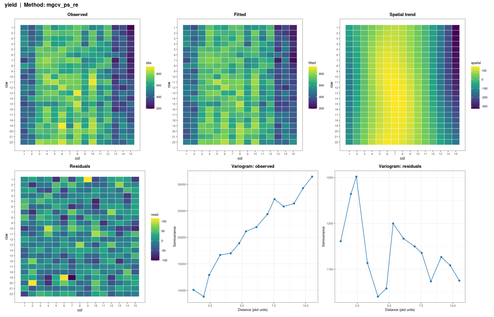
```

#### Conclusion

The performance gap was driven entirely by the missing row/column random effects, not the spline basis type. Changing from cubic regression to P-spline bases alone made negligible difference (residual SD 62.41 vs 63.01). Increasing k had minimal effect (61.88). But adding `s(row_f, bs="re") + s(col_f, bs="re")` dropped residual SD from 62 to 34 — matching SpATS almost exactly (r = 0.9996).

Row and column random effects capture systematic linear-like variation (irrigation gradients along rows, edge drying along columns) that a smooth 2D surface cannot efficiently represent on its own. SpATS and sommer include these by default; any spatial correction model should do likewise.

The optimised mgcv model (`mgcv_ps_re`) is:

$$y_{irc} = g_i + \text{te}(r, c, \text{bs}=\text{"ps"}) + s(\text{row}_r, \text{bs}=\text{"re"}) + s(\text{col}_c, \text{bs}=\text{"re"}) + \varepsilon_{irc}$$


## Part 2: Joint Multi-Bench Models for Unreplicated Designs

### Why per-bench BLUEs fail with unreplicated data

The primary use case involves multiple benches (in our case 4) where genotypes are unreplicated within each bench but replicated across benches. This creates a fundamental statistical problem for per-bench analysis.

When genotype is treated as a fixed effect (to obtain BLUEs), the model estimates one parameter per genotype. With $n$ genotypes and $n$ observations per bench (one per genotype), the genotype effects consume all degrees of freedom and the model is saturated. There is no residual variance left for the spatial smooth to work with. In practice:

- **SpATS** and **sommer** per-bench BLUEs fail outright or produce degenerate estimates
- **mgcv** per-bench BLUEs fit numerically but the spatial smooth is suppressed (EDF $\approx$ 0), rendering the correction useless

Therefore the only viable option with per-bench models on unreplicated data is to use BLUPs with genotype as a random effect ($g_i \sim N(0, \sigma^2_g)$). BLUPs use shrinkage: they borrow strength across genotypes, enabling spatial correction, but pull genotype estimates toward the population mean. The degree of shrinkage is governed by the ratio $\sigma^2_g / \sigma^2_e$. But shrinkage will compresses the genotype value range, may bias effect size estimates for GWAS and underestimate extreme genotypes (often the ones of most interest to breeders).

**Solution: joint multi-bench models.** Fitting a single model across all benches gives each genotype 4 observations (one per bench). The genotype effect becomes estimable as a fixed effect, yielding proper BLUEs without shrinkage.

### Simulation design

To validate the joint models against known truth, the `simulate_spatial_data.R` script generates multi-bench trial data with the following structure:

- **4 benches**, 10 rows × 30 columns = 300 genotypes per bench
- Genotypes unreplicated within bench; each genotype appears once per bench (4 total observations)
- **Spatial pattern: type 6 (edge effects)** — elevated at field borders with diagonal asymmetry (top-left high, bottom-right low), centred to mean zero. This mimics glasshouse bench effects: drying at exposed edges, irrigation run-off gradients, asymmetric light or wind exposure.
- **Varying spatial intensity per bench**: 15, 25, 40, 60 — from moderate (intensity 15 ≈ ±6 units, half of genotype SD) to very high (intensity 60 ≈ ±23 units, nearly twice genotype SD of 12)
- Genotype SD = 12, error SD = 4

```{r s2-true-spatial, fig.cap="**Figure 2.1:** True spatial patterns for each bench (type 6: edge effects with diagonal asymmetry). A single shared colour scale is used across all four panels to directly convey the 4-fold increase in spatial severity from Bench1 (intensity = 15) to Bench4 (intensity = 60, dominant yellow-to-purple contrast). The pattern mimics glasshouse edge effects: elevated phenotypes at borders, depressed in the interior."}
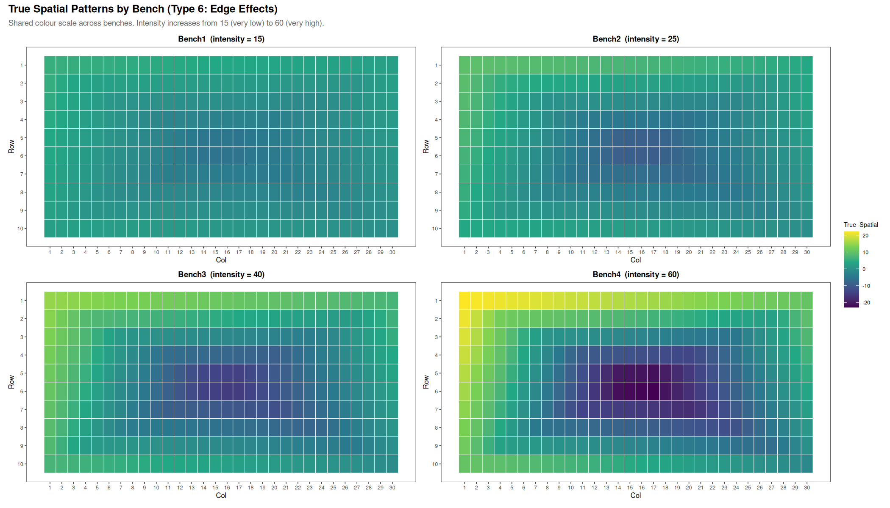
```

### Per-bench SpATS BLUPs: the shrinkage problem

With unreplicated within-bench data, running SpATS for each bench separately is limited to BLUPs. The figure below shows that BLUPs are systematically compressed relative to the true genotype values with the slope against the 1:1 line visibly less than 1 in every bench. This pattern becomes visibly more apparent as the intensity of the spatial pattern increases:

```{r s2-blup-shrinkage, fig.cap="**Figure 2.2:** Per-bench SpATS BLUPs vs true genotype values. In every bench, BLUPs are compressed toward the mean (the cloud is flatter than the 1:1 reference line in red). Crucially, the degree of shrinkage is similar across all four benches regardless of spatial severity — shrinkage is a property of the random genotype model, not of the spatial correction. Averaging BLUPs across benches reduces noise but cannot remove the shrinkage bias."}
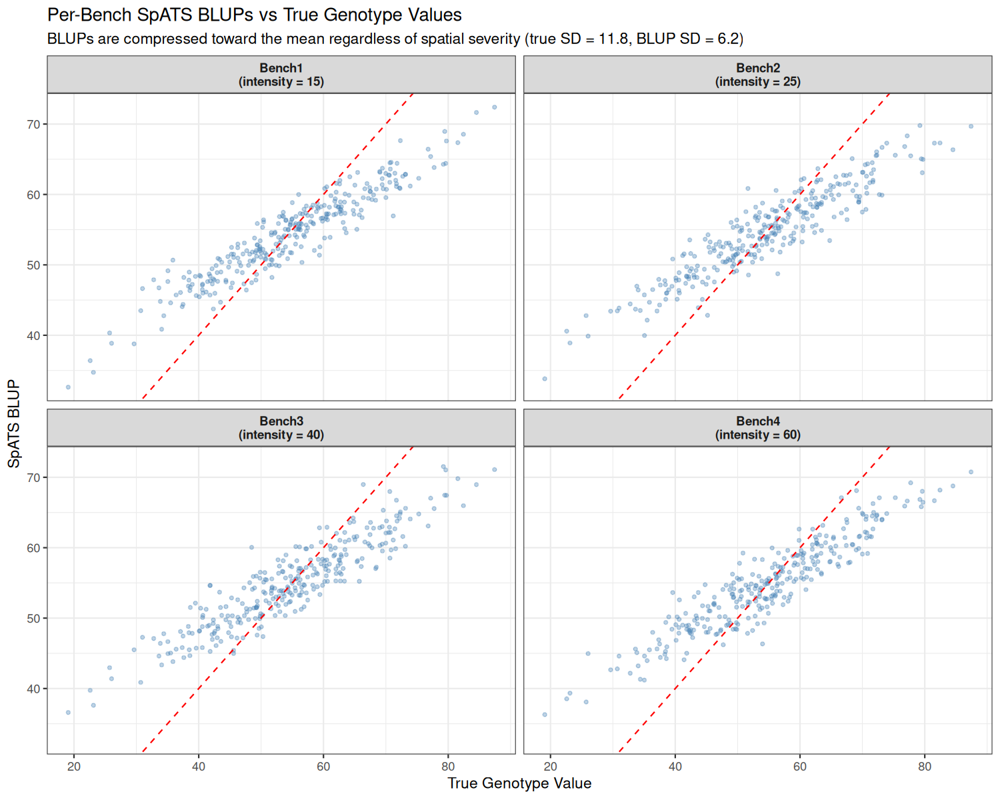
```

### Joint model specifications

#### Joint mgcv model

The joint mgcv model fits a single GAM across all benches with per-bench spatial surfaces:

$$y_{ijk} = g_i + \beta_k + f_k(r_j, c_j) + \rho_{j(k)} + \kappa_{j(k)} + \varepsilon_{ijk}$$

| Term | Type | Description |
|------|------|-------------|
| $g_i$ | Fixed (`0 + Genotype`) | Genotype effect — each coefficient is directly a BLUE |
| $\beta_k$ | Fixed (`bench_f`) | Bench main effect — absorbs overall bench-level differences. Required because factor-by smooths `te(..., by=bench_f)` are centred. |
| $f_k(r, c)$ | Penalised smooth (`te(..., by=bench_f)`) | Separate spatial surface per bench, each with its own independently estimated smoothness |
| $\rho_{j(k)}$ | Random (`s(row_f, bench_f, bs="re")`) | Row random intercept nested within bench |
| $\kappa_{j(k)}$ | Random (`s(col_f, bench_f, bs="re")`) | Column random intercept nested within bench |
| $\varepsilon_{ijk}$ | $N(0, \sigma^2_e)$ | Plot-level residual |

BLUEs are extracted directly as `coef(m)[paste0("Genotype", levels)]`.

#### Joint sommer model

The joint sommer model uses `mmes()` with genotype and bench as fixed effects:

$$y_{ijk} = \mu + g_i + \beta_k + u_{jk} + \rho_{j(k)} + \kappa_{j(k)} + \varepsilon_{ijk}$$

| Term | Type | Description |
|------|------|-------------|
| $\mu$ | Fixed intercept | Grand mean |
| $g_i$ | Fixed (`Genotype`) | Genotype effect (treatment contrasts) |
| $\beta_k$ | Fixed (`Bench_f`) | Bench main effect |
| $u_{jk}$ | Random (`spl2Dc`) | 2D P-spline spatial surface per bench (see column-offset trick below) |
| $\rho_{j(k)}$ | Random | Row RE nested within bench |
| $\kappa_{j(k)}$ | Random | Column RE nested within bench |
| $\varepsilon_{ijk}$ | $N(0, \sigma^2_e)$ | Plot-level residual |

**Column-offset trick:** sommer 4.4.4 does not support `vsm(dsm(bench), spl2Dc(...))` directly. The workaround shifts each bench's column coordinates to non-overlapping ranges with a 10× gap (Bench1: cols 1–30, Bench2: cols 301–330, Bench3: cols 601–630, Bench4: cols 901–930). The large gap prevents cross-bench smoothing in the single `spl2Dc` call, effectively fitting independent surfaces per bench. This is a workaround for the sommer limitation, and can potentially impact the BLUEs (see note 3.5.4).

BLUEs are recovered via `X_pred %*% m$b`, constructing predictions at each bench level and averaging per genotype.

### Validation results

Four approaches are compared:

1. **Uncorrected** — raw per-genotype mean across benches (no spatial correction)
2. **Per-bench SpATS BLUPs averaged** — per-bench SpATS with genotype as random, BLUPs averaged
3. **Joint mgcv BLUEs** — single joint GAM, genotype as fixed effect
4. **Joint sommer BLUEs** — single joint mixed model, genotype as fixed effect

#### Summary metrics

```{r s2-summary}
summary_df <- read.csv("../output/section2/comparison_summary.csv")
knitr::kable(summary_df, digits = c(0, 4, 2),
             col.names = c("Approach", "r(est, true)", "RMSE"),
             caption = "**Table 2.1:** Genotype recovery accuracy. r = Pearson correlation with true genotype values (higher is better). RMSE = root mean squared error in genotype value units (lower is better). Joint BLUEs substantially outperform per-bench BLUP averages on RMSE.")
```

#### Estimated spatial trends

```{r s2-mgcv-spatial, fig.cap="**Figure 2.3:** Estimated spatial trends from the joint mgcv model. Shared colour scale across panels (same scale as Figure 2.1). Bench1 (intensity = 15) shows a moderate edge-effect pattern, correctly estimated with low spatial amplitude. Bench4 (intensity = 60) shows the strong edge-effect pattern, correctly recovered. The model adapts spatial complexity independently to each bench via the te(..., by=bench_f) term."}
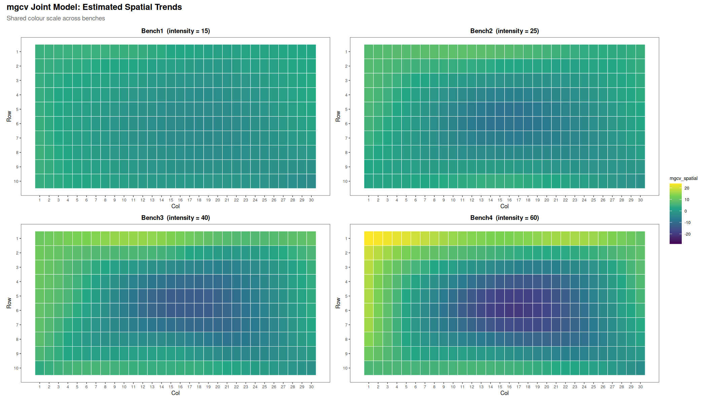
```

```{r s2-sommer-spatial, fig.cap="**Figure 2.4:** Estimated spatial trends from the joint sommer model (column-offset approach). Shared colour scale across panels. The overall patterns align with both the true spatial structure (Figure 2.1) and the mgcv estimates (Figure 2.3). However, the magnitude of the estimated surfaces is systematically attenuated, particularly in benches with higher intensity. This attenuation is caused by B-spline boundary penalisation at the column edges and is the root cause of the BLUE upward shift described below."}
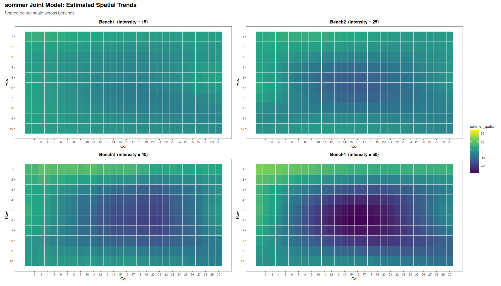
```

#### Scatter plots: estimates vs true genotype values

```{r s2-scatter, fig.cap="**Figure 2.5:** Estimated vs true genotype values for all four approaches. Joint mgcv BLUEs (bottom left) cluster tightly around the 1:1 line across the full range of true values. Joint sommer BLUEs (bottom right) also correlate well with true values but show a systematic upward shift above the 1:1 line — all estimates are positively biased. Per-bench SpATS BLUP averages (top right) show visible compression toward the mean — the cloud is narrower on the y-axis than on the x-axis. Uncorrected means (top left) show wider scatter caused by unremoved spatial bias."}
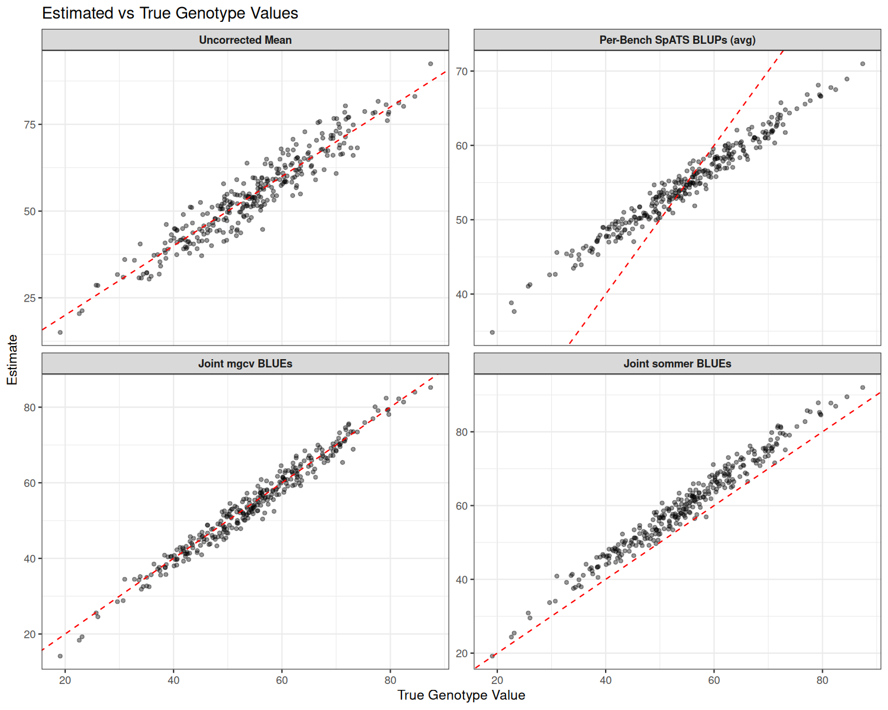
```

#### Why sommer joint BLUEs are shifted above the 1:1 line

The scatter plot (Figure 2.5) shows that all sommer joint BLUEs are positively biased and sit consistently above the 1:1 reference line rather than scattered around it. This is not a model failure but an artefact of the column-offset trick interacting with the edge-effect spatial pattern (type 6).

The column-offset trick assigns non-overlapping column coordinate ranges to each bench, with 10× gaps between them (e.g., Bench1: cols 1–30, Bench2: cols 301–330). Within the single `spl2Dc` fit, B-spline basis functions at the boundary of each bench's column range extend into the adjacent empty gap region. Because there are no observations in the gap, REML penalises these boundary basis functions strongly toward zero effectively forcing the estimated spatial surface to be flat near each bench's column edges.

The type 6 spatial pattern is strongest precisely at the borders and the edges where the B-spline penalty is most aggressive. As a result, sommer systematically underestimates the spatial correction near the column boundaries, leaving a residual positive spatial signal unaccounted for. Since sommer's spatial term is a random effect constrained to be mean zero, this unmodelled positive signal has nowhere to go except the bench fixed effects, which absorb it as a positive offset. Every genotype BLUE is then inflated by this bench-specific constant, producing the uniform upward shift visible in Figure 2.5.

The magnitude of the shift scales with spatial intensity: benches with stronger edge effects have larger column-boundary underestimation and therefore larger BLUE inflation. This is confirmed by the per-bench spatial component means, which are all negative (approximately −2, −4, −6, and −9 units for benches 1 through 4 at intensities 15, 25, 40, and 60 respectively), exactly compensating for the positive offset absorbed into the fixed effects. The net effect is that sommer correlation with true values remains high (r ≈ 0.985), rankings are preserved, but the RMSE is inflated relative to mgcv.

This limitation is specific to the column-offset workaround. A native `vsm(dsm(bench), spl2Dc(...))` implementation would fit each bench's surface with proper column boundaries, eliminating the gap-induced penalty. Until sommer supports this syntax, joint mgcv (`te(..., by=bench_f)`) is the preferred approach for designs with strong column-edge spatial patterns.

#### Per-bench residual SD

```{r s2-residuals}
resid_df <- read.csv("../output/section2/residual_summary.csv")
knitr::kable(resid_df, digits = c(0, 0, 0, 2),
             col.names = c("Bench", "Intensity", "Method", "Residual SD"),
             caption = "**Table 2.2:** Per-bench residual SD for joint models. True error SD = 4.0. All values remain close to 4.0 across the full intensity range (15 to 60), confirming that both joint models adapt correctly to heterogeneous spatial severity.")
```

### Summary of findings

#### Joint BLUEs outperform per-bench BLUP averages

The RMSE for joint mgcv BLUEs (~2.1) is approximately 3× lower than for averaged per-bench SpATS BLUPs (~6.2). The RMSE difference is driven by shrinkage: BLUPs compress the genotype value range toward the mean, inflating RMSE even when correlations are similar. BLUEs estimate actual genotype means without shrinkage, producing estimates on the correct scale which is essential for GWAS where effect sizes matter.

#### Joint mgcv recovers genotype values with high accuracy

Joint mgcv (r ≈ 0.986, RMSE ≈ 2.1) substantially outperforms the per-bench approach. Its fixed-effect spatial smooth (`te(..., by=bench_f)`) can absorb spatial variation at all scales with proper per-bench boundaries, producing near-unbiased BLUEs across the full intensity range.

#### Joint sommer preserves rankings but shows a systematic BLUE offset

Joint sommer (r ≈ 0.985, RMSE ≈ 5.8) preserves genotype rankings almost as well as mgcv, but inflated RMSE relative to mgcv reflects the systematic upward bias in BLUEs caused by the column-offset boundary artefact described above. For applications where BLUE magnitude matters (e.g., GWAS effect size estimation), joint mgcv is preferred. For ranking-based applications, both methods perform comparably.

#### Per-bench spatial surfaces adapt correctly across the full intensity range

Residual SD is consistent across all four benches (3.3–3.6) despite a 4-fold variation in spatial intensity (15 to 60 units). This confirms that both `te(..., by=bench_f)` and the column-offset `spl2Dc` fit genuinely independent surfaces that scale correctly from the moderate pattern of Bench1 to the strong edge effects of Bench4.

#### SpATS per-bench is limited to BLUPs in this design

SpATS cannot produce BLUEs from unreplicated within-bench data and does not natively support joint multi-bench models. For the glasshouse designs we typically use (unreplicated within bench, replicated across benches), mgcv or sommer joint models are required to obtain proper BLUEs.

### Package dependencies

| Package | Version | Role |
|---------|---------|------|
| SpATS | 1.0.19 | 2D P-spline spatial correction (SAP) |
| mgcv | 1.9.4 | GAM with tensor-product smooths |
| sommer | 4.4.4 | Mixed model with `spl2Dc` spatial random effect |
| ggplot2 | — | Heatmap and variogram plots |
| patchwork | — | Multi-panel figure layout |

## TODO

| Item | Description |
|------|-------------|
| Integration into `run_spatial_correction()` | Joint functions currently called directly; need orchestration with PDF/CSV output |
| Partial genotype overlap | Test information-sharing when genotype sets differ across benches |
| GxE modelling | Allow genotype-by-environment interaction in joint models |
| Real data validation | Validate joint models on actual multi-bench field trial data |

---

## Appendix: Joint mgcv performance under row and column gradient patterns

The main analysis used a type 6 edge-effect spatial pattern. This appendix tests the joint mgcv model under three additional spatial patterns — a row gradient, a column gradient, and a localised hotspot — using the same 4-bench unreplicated design with intensities 15, 25, 40, 60. Row and column gradients are among the most common spatial artefacts in glasshouse trials (e.g., uneven watering along rows, light attenuation along bench columns). The hotspot pattern mimics a localised point-source disturbance such as a roof leak or a faulty irrigation emitter, affecting approximately 20% of pots in a circular region centred off-centre within the bench.

All three patterns are centred to mean zero per bench, so the spatial effect represents a deviation from the bench mean rather than an absolute level shift. Genotype SD = 12, error SD = 4.

### True spatial patterns

```{r sa-true-spatial, fig.cap="**Figure A1:** True spatial patterns for row gradient (top), column gradient (middle), and localised hotspot (bottom) across four benches. Spatial intensity increases left to right (15, 25, 40, 60). Colour scale is shared within each pattern type. The hotspot is an off-centre Gaussian bell covering ~20% of pots, mimicking a localised glasshouse disturbance."}
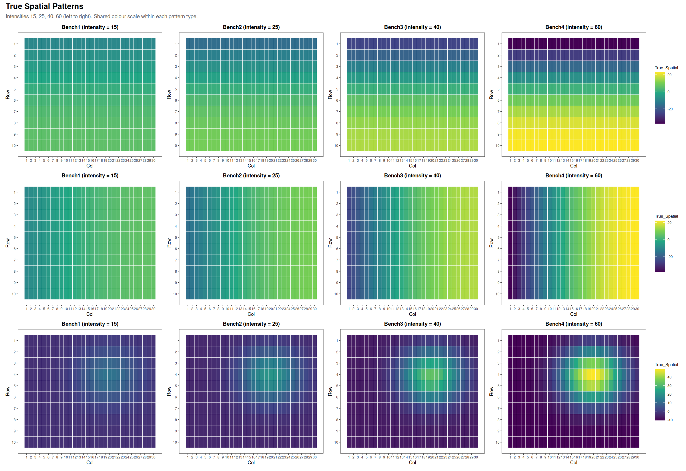
```

### Estimated spatial trends (joint mgcv)

```{r sa-mgcv-spatial, fig.cap="**Figure A2:** Estimated spatial trends from the joint mgcv model for row gradient (top), column gradient (middle), and localised hotspot (bottom). The model correctly identifies each spatial structure and scales the estimated surface to bench intensity. For the hotspot, recovery is tested across intensities: the compact Gaussian pattern is more challenging to estimate than a smooth gradient as it concentrates variation in a small spatial region."}
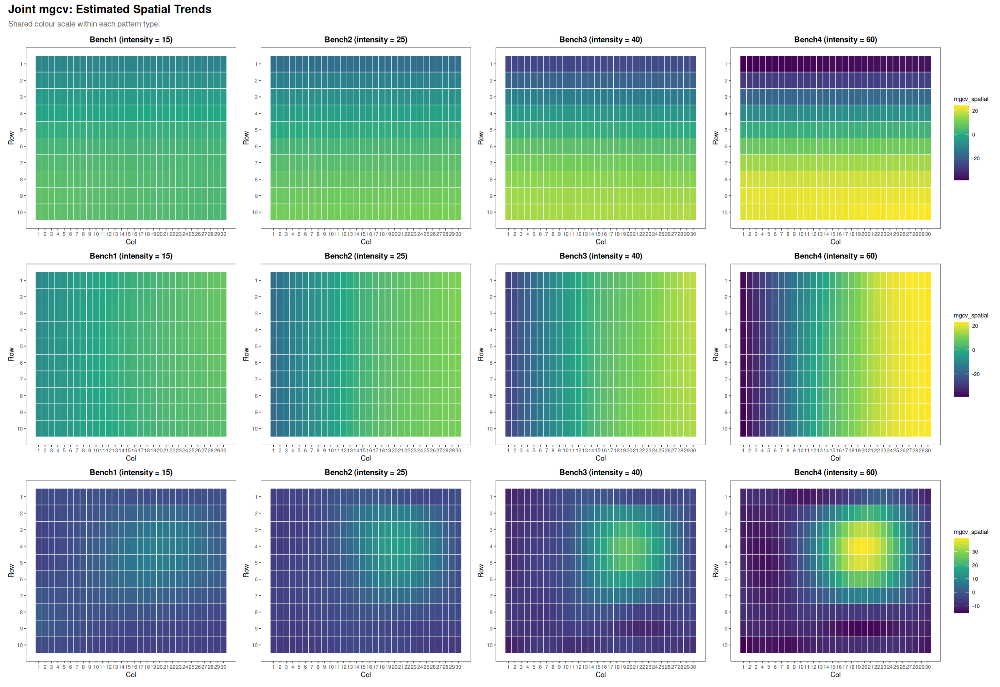
```

### Genotype recovery

```{r sa-scatter, fig.cap="**Figure A3:** Estimated vs true genotype values for all three approaches (columns) and all three spatial patterns (rows). Joint mgcv BLUEs (right column) cluster closely around the 1:1 line across all pattern types. Uncorrected means (left) show substantial scatter from unremoved spatial effects. Per-bench SpATS BLUPs (centre) improve correlation but retain compression toward the mean."}
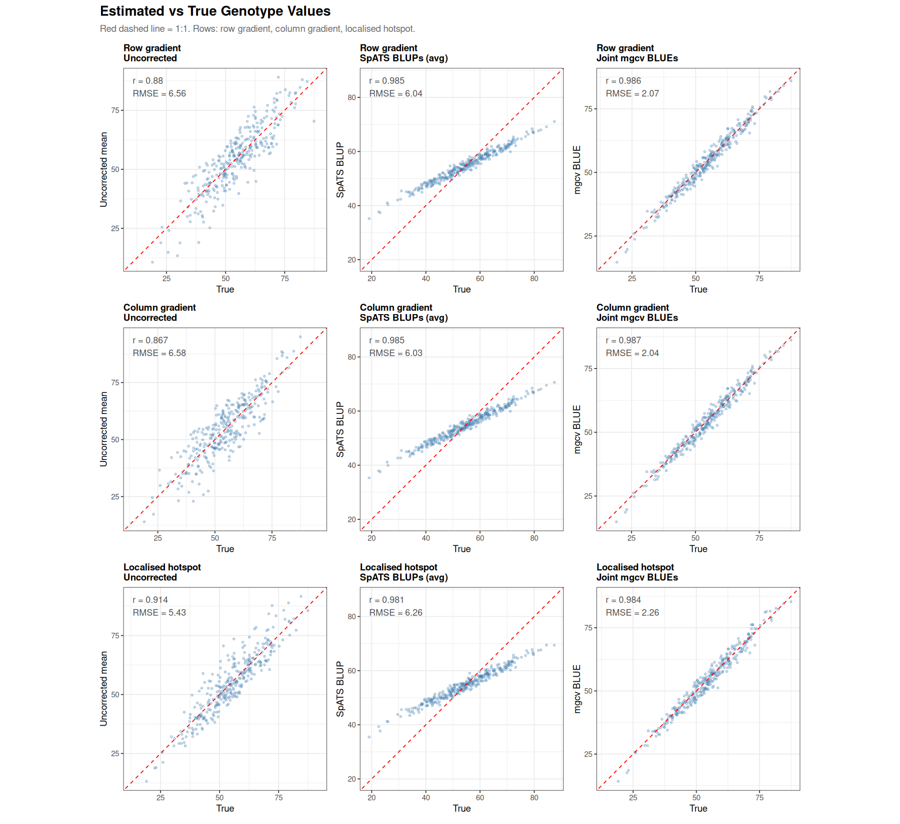
```

### Performance summary

```{r sa-summary}
app_df <- read.csv("../output/appendix/appendix_summary.csv")
knitr::kable(app_df, digits = c(0, 0, 4, 2),
             col.names = c("Pattern", "Approach", "r(est, true)", "RMSE"),
             caption = "**Table A1:** Genotype recovery accuracy for row and column gradient patterns. Joint mgcv BLUEs achieve substantially lower RMSE than per-bench SpATS BLUPs despite similar correlations, confirming that the BLUE/BLUP distinction (not spatial correction quality) drives the difference. Results are consistent across both gradient directions.")
```

### Summary

Joint mgcv performs consistently well across all three pattern types. Correlation with true genotype values is high across all patterns (r ≈ 0.984–0.987) and RMSE for mgcv BLUEs is low (2.0–2.3 units) compared to averaged per-bench SpATS BLUPs (6.0–6.3 units). The RMSE gap reflects BLUP shrinkage, not a failure of spatial correction — SpATS successfully removes the spatial structure, but the shrunken BLUPs cannot recover the full genotype spread.

The localised hotspot is slightly more challenging than the gradient patterns (mgcv RMSE 2.26 vs ~2.05 for gradients), which is expected: a compact Gaussian concentrated in ~20% of pots places fewer constraints on the tensor-product smooth than a global gradient, giving the model less information to distinguish hotspot from noise at low intensity. Nevertheless, performance remains strong across all intensities tested.
